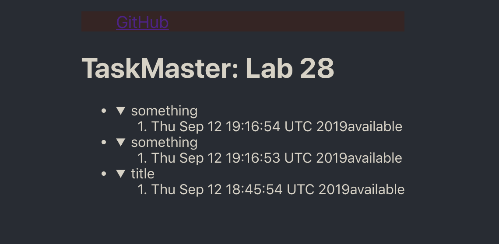

## Description:
- Deploy a completely serverless frontend in an S3 bucket, 
- with API gateways configured with lambda functions triggering backend functions
- dynamo database
- S3 bucket for pictures

## challenge information

- Add Notifications to TaskMaster Cloud
- Create an API Gateway endpoint that accepts a POST containing a Phone Number in the JSON sent into it’s body
- This route should run the taskmasterSubscribe lambda function, allowing anyone to subscribe to the TaskComplete SNS Topic
Refactor the Lambda function that handles the “write” operations on the Dynamo Database
- When it fires, if the operation has marked the task as “Completed” …
Instead of just logging that activity …
- It should send a message to the TaskComplete topic with text to indicate that the task has been completed.
- Update your React application with a form that allows the user to enter their phone number so that they can be notified when tasks are completed
- This should POST to your new API route and subscribe the user

## location
- this frontend hosts a link to the backend taskmaster, which is no longer being used
- Here you can see what tasks have been created.  
- [Frontend](http://taskmaster-frontend-jack.s3-website-us-west-2.amazonaws.com/)
- [Backend](http://taskmaster1-dev.us-west-2.elasticbeanstalk.com/api1/v2/tasks)
- Challenge by: Codefellows
- Author: Jack Daniel Kinne
- 

## Screenshots
- 

## This project was bootstrapped with [Create React App](https://github.com/facebook/create-react-app).

## Available Scripts

In the project directory, you can run:

### `npm start`

Runs the app in the development mode. 
Open [http://localhost:3000](http://localhost:3000) to view it in the browser.

The page will reload if you make edits. 
You will also see any lint errors in the console.

### `npm run build`

Builds the app for production to the `build` folder. 
It correctly bundles React in production mode and optimizes the build for the best performance.

The build is minified and the filenames include the hashes. 
Your app is ready to be deployed!

See the section about [deployment](https://facebook.github.io/create-react-app/docs/deployment) for more information.

## credit and Contributions
- Marisha Hoza
- Brandon Hurrington
- Kevin Couture
- Travis Cox
- Nick Paro